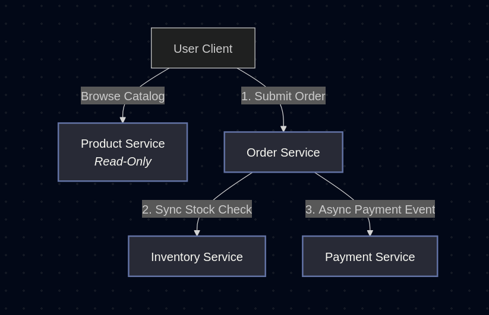
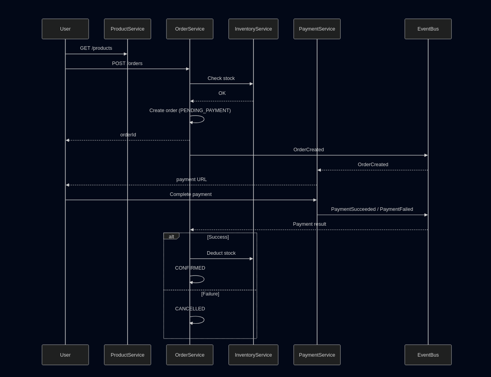

# 🛒 OMNICHAIN-STORE Microservices App

A simple **learning project** to understand microservices architecture using an e-commerce domain.

The system focuses on:
- Clear service boundaries
- Contract-first design
- Basic event-driven communication

---

## 🧩 Architecture

For the moment, the system is composed of four services:

***Product Service (read-only, accessed directly by user)***
- **Order Service**: manages order lifecycle
- **Inventory Service**: checks and deducts stock
- **Payment Service**: handles payment flow (user-driven)
- **Product Service**: exposes product catalog  

## 🔄 Sequence Diagram (Simplified Flow)

